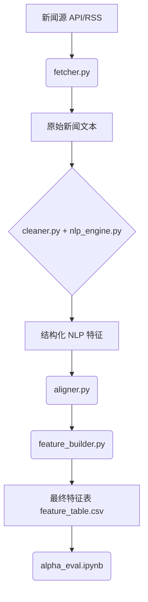

# 🧠 News2Alpha: 从加密货币新闻中提取 Alpha 信号

**项目定位**: 一个专注于 crypto 市场、基于 NLP 的 alpha signal 构建系统，结构清晰、工程标准高，完全可复现。

## ✅ 项目目标

构建一个端到端的 NLP 信号提取系统，自动抓取加密市场新闻，清洗文本，提取结构化特征（如情感分数、关键词密度、实体提及），将其与市场行情对齐，输出用于 alpha 评估的特征表与信号图表。

## 🧩 数据处理流程

## 🧱 功能模块说明

| 模块 | 文件 | 功能说明 |
| :--- | :--- | :--- |
| 📡 **新闻抓取** | `fetcher.py` | 抓取加密新闻：CoinDesk / CryptoPanic / Reddit RSS |
| 🧹 **文本清洗** | `cleaner.py` | 去 HTML、语言检测、分词、去除停用词、标准化 |
| 🧠 **NLP 特征提取** | `nlp_engine.py` | 使用 FinBERT 情感分析、关键词提取（KeyBERT）、NER（spaCy）等 |
| ⏱ **时间对齐** | `aligner.py` | 将新闻按时间聚合到 market candle（如5分钟），确保 signal → future |
| 🧮 **Signal 构造** | `feature_builder.py` | 构造结构化 alpha 信号，如：情感均值、mention_count("hack") 等 |
| 💾 **数据输出** | `storage.py` | 存储为 feature_table.csv、SQLite、Parquet 等格式 |
| 📊 **Alpha 评估** | `notebooks/alpha_eval.ipynb` | 计算信号表现：IC、hit ratio、decay、可视化 |
| 📁 **工程可复现性** | `main.py` + `config.yaml` | 参数化运行、模块组织、易读易改 |
| 🧾 **说明文档** | `README.md` | 展示项目动机、架构、样例输出、执行方式等 |

## 📈 最终输出示例

| timestamp | asset | sentiment_mean | hack_mentions | topic_entropy | return_5min |
| :--- | :--- | :--- | :--- | :--- | :--- |
| 2025-07-01 12:00 | SOL | +0.41 | 3 | 1.77 | +0.58% |
| 2025-07-01 12:05 | SOL | -0.12 | 0 | 0.92 | -0.84% |

## 🎯 项目交付标准

- **[✅] 项目代码结构**: 完整的模块目录 + 清晰的 `src/` 文件划分
- **[✅] 可运行主入口**: `main.py` + `config.yaml` 可运行一条完整 pipeline
- **[✅] NLP 特征表**: `feature_table.csv`（或 SQLite）含 timestamp + signals + return
- **[✅] Notebook 分析**: `alpha_eval.ipynb` 展示 IC / 分组收益 / decay / signal 分布
- **[✅] README.md**: 项目介绍、架构图、模块说明、运行方法、示例数据图
- **[✅] GitHub 项目页**: 精简展示：项目定位 + 安装运行方法 + 样例图表
- **[✅] 清晰命名 + 工程化风格**: 全部变量命名规范，模块独立，支持单元测试或断点调试

## 💡 项目展示场景建议

| 场景 | 说法示例 |
| :--- | :--- |
| 📄 **简历** | `News2Alpha: A modular NLP signal pipeline that extracts tradable features from crypto news and evaluates alpha potential using IC and decay analysis.` |
| 🧑‍💻 **面试** | “我构建了一个从 CoinDesk、Reddit 等平台抓取的 NLP 流水线系统，生成情感驱动因子，能用信息系数衡量短期市场预测力。” |
| 🌐 **GitHub** | “An open-source NLP signal extractor for the crypto market. From headlines to structured alpha in minutes.” |

---

> **核心价值**: 本项目的核心是构建一个**可复现的**从新闻文本 → NLP处理 → Alpha信号 → 可量化评估的完整 pipeline。它不涉及建模或交易，但构成了任何严肃量化信号研究的起点。

